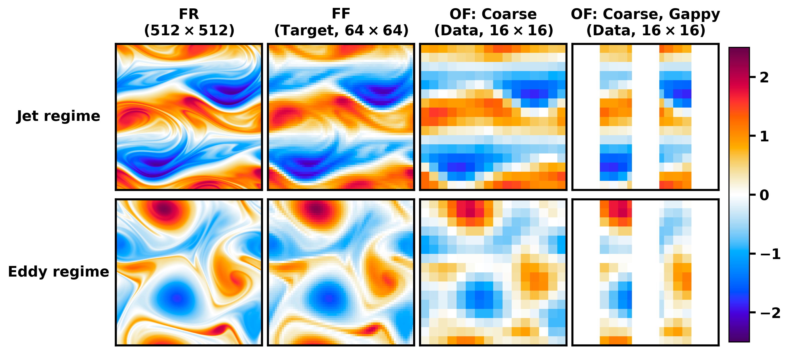

# Guided Unconditional and Conditional Generative Models for Super-Resolution and Inference of Quasi-Geostrophic Turbulence



This repository is associated with our paper, ["Guided Unconditional and Conditional Generative Models for Super-Resolution and Inference of Quasi-Geostrophic Turbulence"](Arxiv). It contains trained weights and codes for training and generation with two guided unconditional models ([SDEdit](https://arxiv.org/abs/2108.01073), [Diffusion Posterior Sampling](https://arxiv.org/abs/2209.14687)), and two conditional models w/ and w/o [Classifier-Free Guidance](https://arxiv.org/abs/2207.12598).
---
## Installation

Clone this repository. Then, create a virtual environment and install dependencies:
   ```bash
   python3 -m venv venv
   source venv/bin/activate
   pip install -r requirements.txt
   ```
---
## Usage

Quasi-geostrophic simulations and data associated with this code can be downloaded [here](https://zenodo.org/records/15742146).

For training or generation, start from the Driver/ directory. Please change the directory names within according to your workflow. 

The Config/ directory provides example configuration files to train with unconditional and conditional models, and sample (generate) with 4 guided diffusion models.

The Weights/ directory contains pre-trained weights for super-resolution of forced quasi-geostrophic turbulence in the eddy (beta = 0) and jet (beta > 0) regimes at two Reynolds numbers (10<sup>3</sup>, 10<sup>4</sup>) with coarse-resolution fields and coarse, sparse and gappy (partial) observations.

## Citing This Work

If you use find this work interesting, please cite our paper, codes, or dataset:

```bibtex
@Misc{suresh_babu_et_al_2025,
  author =	 {Suresh Babu, Anantha Narayanan and Sadam, Akhil and Lermusiaux, Pierre F. J.},
  title =	 {Guided Unconditional and Conditional Generative Models for Super-Resolution and Inference of Quasi-Geostrophic Turbulence [{D}ataset]},
  month =	 jun,
  year =	 2025,
  doi = {10.5281/zenodo.15742146},
  howpublished = {Zenodo},
}
```
---

## License

This project is licensed under the MIT License. See the `LICENSE` file for details.

---
